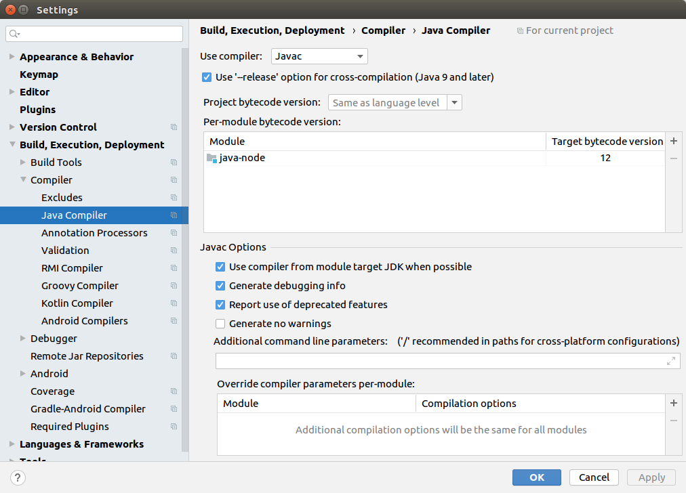
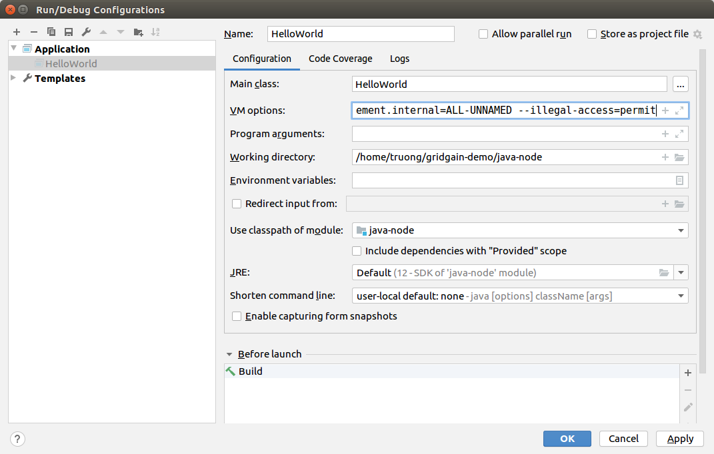

# GridGain - Ignite 
# Intelliji IDEA - Community Edition Setup 
- Setup date: Friday, 26th June 2020
- Host Operating System: Ubuntu 16.04 Desktop

## Buid a Maven Project with Dependencies
- Create a Maven Project
- Edit the `pom.xml` with additional dependencies
  - `pom.xml` file used in this project: [pom.xml](../application-examples/pom.xml)
- Build the project

## Setup Java Compiler
- Change the `Target bytecode version` of Java Compiler to 12 (supported by Java compilers with version from 6 to 12)


## Set parameters to the JVM
- **This part is for the use of GridGain with Java 11 or later**.
- Pass the following flags to the VM of Intelliji to enable proprietary SDK APIs that are not available by default
```
--add-exports=java.base/jdk.internal.misc=ALL-UNNAMED
--add-exports=java.base/sun.nio.ch=ALL-UNNAMED
--add-exports=java.management/com.sun.jmx.mbeanserver=ALL-UNNAMED
--add-exports=jdk.internal.jvmstat/sun.jvmstat.monitor=ALL-UNNAMED
--add-exports=java.base/sun.reflect.generics.reflectiveObjects=ALL-UNNAMED
--add-opens=jdk.management/com.sun.management.internal=ALL-UNNAMED
--illegal-access=permit
```


- Ref: [GridGain for Java | GridGain Documentation](https://www.gridgain.com/docs/latest/getting-started/quick-start/java)

