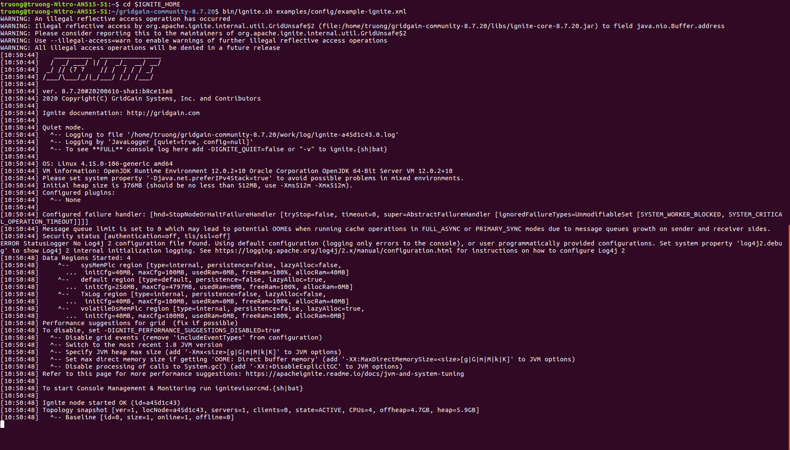

# GridGain - Ignite 
# Execution of Example Applications 

- The example of **Compute Grid** includes:
  - [Broadcasting a task between nodes](./guide-3_app-1_broadcastTask.md)
  - [Counting characters (a task is divided into sub-tasks which do a similar thing)](./guide-3_app-2_charactersCount.md)
  - [Making a dish (a task is divided into sub-tasks which do different things)](./guide-3_app-3_makeMeal.md)

## Intitialization of a Compute Grid Environment with two Server Nodes
1. Open the first terminal and navigate to the IGNITE_HOME path
- $> `cd $IGNITE_HOME`
2. Launch the first server node with example custom configuration file
- $> `bin/ignite.sh examples/config/example-ignite.xml`
- Output on the terminal should have the info of one new starting server:
```
[11:00:13] Ignite node started OK (id=acf15a35)
[11:00:13] Topology snapshot [ver=1, locNode=acf15a35, servers=1, clients=0, state=ACTIVE, CPUs=4, offheap=4.7GB, heap=5.9GB]
[11:00:13]   ^-- Baseline [id=0, size=1, online=1, offline=0]
```
- A server node with id=acf15a35 is started. Currently, there is 1 server, and the size of the grid compute cluster is 1.



3. Open the second terminal and navigate to the IGNITE_HOME path
- $> `cd $IGNITE_HOME`
4. Launch the second server node with example custom configuration file
- $> `bin/ignite.sh examples/config/example-ignite.xml`
- Output on the both terminals should have the info of one additional new starting server:
  - The terminal of the first server node should also be updated with the info of a new starting server

*terminal of the second server node*
```
[11:08:58] Ignite node started OK (id=d33d18a8)
[11:08:58] Topology snapshot [ver=2, locNode=d33d18a8, servers=2, clients=0, state=ACTIVE, CPUs=4, offheap=9.4GB, heap=12.0GB]
[11:08:58]   ^-- Baseline [id=0, size=2, online=2, offline=0]
```
- A server node with id=d33d18a8 is started. Currently, there are 2 servers and the size of the grid compute cluster is 2.

5. Check the firts server node
*terminal of the first server node*
```
[11:08:57] Joining node doesn't have encryption data [node=d33d18a8-ab11-46a3-85b3-b7907a1cff2c]
[11:08:57] Topology snapshot [ver=2, locNode=acf15a35, servers=2, clients=0, state=ACTIVE, CPUs=4, offheap=9.4GB, heap=12.0GB]
[11:08:57]   ^-- Baseline [id=0, size=2, online=2, offline=0]
```
- The first server node is updated with the join of the second server node


